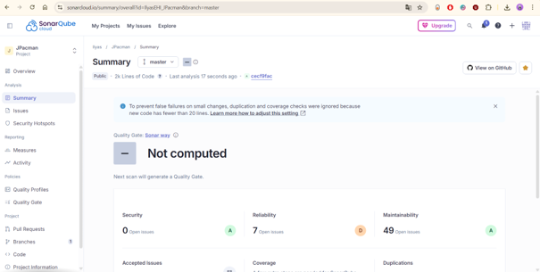

# Partie 2: JPacman avec SonarQube

## a) Capture d'écran
Prenez une capture d'écran de l'écran d'accueil avec le nom du projet.

**Réponse:**

Afin de pallier les problèmes de compatibilité entre les versions locales de Java et le serveur SonarQube (erreurs de verrouillage de nœuds et de version de classe), j'ai utilisé **SonarCloud** pour effectuer l'analyse du projet JPacman.

---

## b) Liste des artéfacts nécessitant du refactoring
Donnez la liste des artéfacts (classes et méthodes) qui ont besoin de refactoring.

**Réponse:**

| Artéfact (Classe et méthodes) | Type de problème | Description technique |
|-------------------------------|------------------|-----------------------|
| `Level.java` | Code Smell (Major) | Utilisation massive de `assert` (L95, L141, etc.) au lieu de vérifications réelles. |
| `Ghost.java` & `Blinky`/`Clyde`/`Inky`/`Pinky` | Bug (Critical) | Instanciation répétée de `Random` au lieu de le réutiliser (problème de performance et de prédictibilité). |
| `Navigation.java` | Code Smell (Major) | Retourne `null` au lieu d'une collection vide (risque de `NullPointerException`). |
| `ScorePanel.java` | Code Smell (Critical) | Problèmes de sérialisation et accès non-statique à des constantes Swing. |
| `PointCalculatorLoader.java` | Code Smell (Critical) | Utilisation de types génériques sans paramètres et risque lié au multi-threading (L24). |

---

## c) Comparaison des outils pour identifier les cibles
Parmi CodeScene et SonarQube, lequel est plus utile pour trouver des cibles de refactoring ?

**Réponse:**

Le choix de l'outil dépend de l'objectif du développeur qui code, mais d'après l'analyse avec les deux outils, **CodeScene semble plus pertinent pour identifier les cibles prioritaires d'un point de vue stratégique**.

SonarQube liste de manière exhaustive tous les problèmes techniques : **56 issues détectées**, allant de la simple renommage de variable aux erreurs de sérialisation. En combinant la santé du code avec la fréquence de modification, CodeScene permet de ne pas perdre de temps sur des fichiers "sales" mais qui ne changent jamais.

Cependant, l'analyse a révélé que **SonarQube est plus utile pour un nettoyage systématique du code** car il ne laisse passer aucun détail technique, même dans les fichiers peu modifiés.

**Points clés :**
- **CodeScene** → Priorisation stratégique basée sur la fréquence de modification (Hotspots)
- **SonarQube** → Analyse exhaustive et systématique de tous les problèmes techniques

---

## d) Qualité des explications
Parmi CodeScene et SonarQube, lequel fournit le meilleur raisonnement / explication sur les cibles de refactoring possibles ?

**Réponse:**

**SonarQube offre un meilleur raisonnement technique.** Pour chaque erreur, il explique précisément le risque encouru, comme une faille potentielle ou une baisse de performance, et propose des exemples de correction directement dans l'interface. C'est très efficace pour corriger le code rapidement.

**CodeScene se concentre plutôt sur l'architecture globale.** Il explique pourquoi une méthode est devenue difficile à maintenir à cause de sa structure (comme les conditions trop imbriquées), mais il est moins précis que SonarQube sur la manière concrète de réécrire la ligne de code fautive.

**Comparaison :**

| Critère | SonarQube | CodeScene |
|---------|-----------|-----------|
| **Précision technique** | ✓ Excellente | Modérée |
| **Exemples de correction** | ✓ Fournis directement | Patterns généraux |
| **Explication des risques** | ✓ Détaillée (sécurité, performance) | Architecture et maintenabilité |
| **Vision globale** | Problèmes locaux | ✓ Vue architecturale |

---

## e) Artéfacts communs
Existe-t-il des artefacts communs entre SonarQube (Code Smells) et CodeScene (Refactoring targets) ? Si oui, quels sont-ils ?

**Réponse:**

Oui, on retrouve plusieurs classes problématiques dans les deux analyses.

### Artéfacts communs identifiés

**1. `Navigation.java` - L'exemple le plus frappant**
- **CodeScene** : Signalé pour sa complexité structurelle (Bumpy Road, Complex Conditional)
- **SonarQube** : Erreurs de logique interne (retourne `null` au lieu d'une collection vide)

**2. Classes des fantômes (`Ghost.java`, `Blinky.java`, `Clyde.java`, `Inky.java`, `Pinky.java`)**
- **CodeScene** : Fort couplage entre ces classes et `LevelFactory.java`
- **SonarQube** : Bugs de fiabilité (Critical) sur la gestion de l'aléatoire (instanciation répétée de `Random`)

**3. `CollisionInteractionMap.java`**
- **CodeScene** : Complexité élevée (Worst Performer avec score 8.2), méthodes complexes
- **SonarQube** : Erreurs de paramètres et complexité cyclomatique élevée

### Synthèse

Les deux outils convergent sur les mêmes classes problématiques, mais avec des perspectives complémentaires :
- **CodeScene** → Focus sur la complexité architecturale et le couplage
- **SonarQube** → Focus sur les bugs concrets et les code smells techniques
